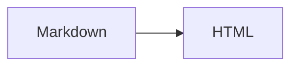

# slidown

Turn plain Markdown into lightweight, self-contained HTML slides with native Mermaid and LaTeX rendering.

- ✍️ **Just Markdown:** Write slides in plain Markdown, without slide-specific syntax or manual layout.
- ⚡ **Lightweight playback:** Mermaid and LaTeX render natively to SVG at build time, with no rendering libraries needed during playback.
- 📦 **Easy to share:** Open the static HTML directly or deploy it to any static host.
- 🎯 **Smooth workflow:** Preview edits live, navigate with the keyboard, and present fullscreen with automatic content scaling.

## Installation and usage

Install with Cargo:

```bash
cargo install slidown

# Read OUTLINE.md and write to ./dist/ by default.
slidown build
slidown serve

# Choose the input, output, and preview options.
slidown build --outline talk.md --output dist
slidown serve --outline talk.md --output dist --port 3000 --open
```

To explore the controls and supported elements, run the [example](examples/OUTLINE.md) from this repository:

```bash
cargo run -- build --outline examples/OUTLINE.md
cargo run -- serve --outline examples/OUTLINE.md
```

Open `dist/index.html` directly in a browser or deploy `dist/` to a static file server. URL subpaths are supported. The generator needs no Node.js or headless browser, and the slides need no browser-side Mermaid or math libraries.

## Markdown structure

````markdown
---
title: Browser tab title
author: Your name
date: "2026-09-12"
email: author@example.com
closing: Thank you!
---

# Cover title

## First content slide

### A heading within the slide

Regular paragraphs, **bold**, *italics*, ~~strikethrough~~, lists, and tables.

> [!TIP]
> Add a useful tip here.

```rust
fn main() {
    println!("Hello, slides!");
}
```

## Diagrams and formulas



An inline formula: $E = mc^2$.

$$
\frac{-b \pm \sqrt{b^2 - 4ac}}{2a}
$$

## Images


````

- The body must start with its only H1, which becomes the cover title.
- **Only blank lines may appear between the H1 and the first H2.** In a cover-only document, only blank lines may follow the H1. Comments and link definitions are not allowed there.
- Each top-level H2 starts a slide. H3–H6 and headings nested in lists or blockquotes stay within the current slide.
- Both ATX and Setext headings work. Headings inside code blocks do not split slides, and `---` follows normal Markdown rules.
- Content scales to fit; slides are never split automatically. Code preserves its original line breaks.

## Front matter

Optional YAML front matter must start the document and use `---` delimiters. Recognized fields accept plain text strings.

| Field | Purpose | When omitted or empty |
| --- | --- | --- |
| `title` | Browser tab title | Uses the H1 text; does not change the cover title |
| `author` | Cover author | Hidden |
| `email` | Cover email, with a `mailto:` link | Hidden |
| `date` | Cover date, displayed as written | Hidden |
| `closing` | Title of an additional closing slide | No closing slide |

The cover contains only its title and metadata. The closing slide counts toward the page total. Unknown fields produce warnings; invalid YAML, duplicate fields, or incorrect field types stop the build. Quote dates to keep them as text.

## Supported content

Common Markdown elements are supported, plus tables, task lists, autolinks, strikethrough (`~~text~~` or `~text~`), highlighting (`==text==`), and GitHub alerts (`NOTE`, `TIP`, `IMPORTANT`, `WARNING`, `CAUTION`). See the [example](examples/OUTLINE.md) for their appearance and usage.

- **Code:** label fences with a language such as `rust`, `python`, or `bash`. Unknown labels fall back to first-line detection or plain text.
- **Mermaid:** use a `mermaid` fence with an explicit diagram type, such as `flowchart LR`. Supported syntax follows the pinned mermaid-rs-renderer version and may differ from mermaid-js.
- **Math:** use `$...$` inline or `$$...$$` for display math, preferably with display delimiters on separate lines. Math follows RaTeX's supported syntax, not full LaTeX documents. Code does not parse math; escape a literal dollar sign as `\$`.
- **Images:** local paths resolve from the Markdown file and are copied to `assets/images/`. Spaces, Unicode filenames, and reference-style images work. Alt text, titles, URL queries, and fragments are preserved. Missing local images stop the build. Remote URLs and `data:` images remain unchanged; remote images require network access.

Footnotes and raw HTML are unsupported. HTML inside code blocks is escaped and displayed as code.

Math fonts are embedded. Extra characters, such as Chinese text in formulas, may require a local font set through `RATEX_UNICODE_FONT=/path/to/font.ttf`; glyphs that cannot be embedded produce an error. Ordinary text and Mermaid use system fonts without downloading fonts.

## Output and preview

Both commands write `index.html` and `assets/` to `dist/` by default; use `--output` to change the directory. Styles, scripts, and copied images are local resources, while Mermaid and formula SVGs are embedded in the HTML.

Keep `assets/.slidown-manifest.json` in the build directory: it identifies generated files for safe updates and obsolete-asset cleanup. Browsers do not need it, so deployment can omit it. Builds protect source files and user edits; conflicting files or symlinks produce an error. Rendering or overwrite-validation errors leave the last successful output intact.

`serve` listens on `127.0.0.1:3000`. Use `--host` and `--port` to change the address, `--port 0` for an available port, or `--open` to launch the browser. It watches Markdown and local images, refreshes on successful builds, and preserves the current slide. Build errors appear over the last successful preview and clear when fixed. Only generated files are served, and the reload script is never written into the static output.

Ctrl-C waits for any active build, then removes the preview's generated files and empty output directories. Source files, user files, and modified artifacts are preserved. If no preview build succeeds, existing output is left alone. `build` keeps its output; `serve` also cleans prior `build` output if it successfully rebuilds it in the same directory.

## Presentation controls

| Action | Shortcut |
| --- | --- |
| Next slide | `Space`, `→`, `↓`, `j`, `l`, `Enter`, `PageDown` |
| Previous slide | `←`, `↑`, `h`, `k`, `Backspace`, `PageUp` |
| First / last slide | `Home` / `End` |
| Toggle fullscreen | `f` |
| Close the diagram viewer | `Esc` |

Click a Mermaid diagram to enlarge it. Drag with the left mouse button to pan; use the wheel or `−` / `＋` to zoom, and `×` to close. Wheel zoom follows the cursor. Diagrams fit the viewer on opening and window resize.

Use `#/5` to open slide 5, counting the cover as slide 1, or `#latex` to open the slide containing that heading. Heading links keep their named fragment; normal navigation updates the page number. Both forms survive a refresh.

## Development and validation

```bash
cargo fmt --check
cargo clippy --all-targets -- -D warnings
cargo test
```

Tests cover parsing, rendering, asset handling, output protection, and live preview. Preview tests need permission to listen on a loopback port.

Optional browser checks require Node.js 22+ and a Chromium-based browser:

```bash
cargo run -- build --outline examples/OUTLINE.md
BROWSER=microsoft-edge node tests/browser.mjs
# Alternatively, use BROWSER=chromium.
```

The browser suite checks navigation, diagram controls, reload behavior, and layout across viewport sizes and extreme content. Screenshots are saved to `target/browser-validation/`.

## Acknowledgments

The layout, styling, and interactions draw on and were inspired by [jyy wiki](https://jyywiki.cn/).

- Alert styles follow [GitHub's Markdown alerts](https://github.com/orgs/community/discussions/16925) and [Primer](https://github.com/primer/css), which is licensed under MIT.
- Alert icons come from [GitHub Octicons](https://github.com/primer/octicons), licensed under MIT.
- Formula glyphs use the [KaTeX fonts](https://github.com/KaTeX/KaTeX) bundled with [RaTeX](https://github.com/erweixin/RaTeX). The fonts are licensed under SIL OFL 1.1; the RaTeX and KaTeX software is licensed under MIT.
