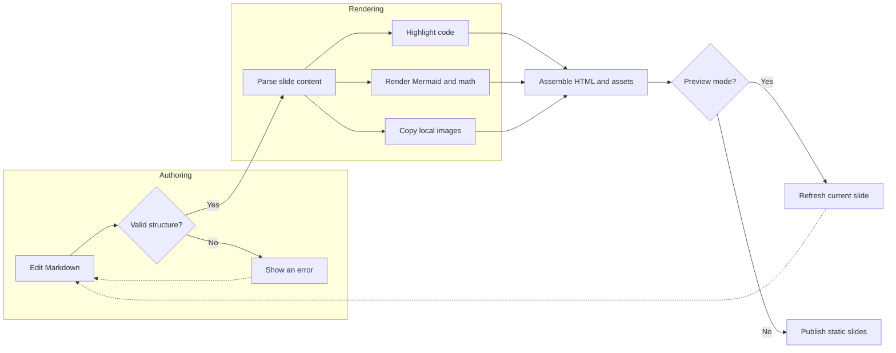

# Write Slides in Markdown

## Presentation Controls

| Action | Keys |
| :--- | :--- |
| Next slide | `Space`, `→`, `↓`, `j`, `l`, `Enter`, `PageDown` |
| Previous slide | `←`, `↑`, `h`, `k`, `Backspace`, `PageUp` |
| First / last slide | `Home` / `End` |
| Toggle fullscreen | `f` |
| Close the diagram viewer | `Esc` |

Click a Mermaid diagram to enlarge it. **Drag to pan**, use the wheel or **− / ＋** to zoom, and **×** to close.

Try a [heading link](#latex) or a [page-number link](#/3). Both survive a refresh; normal navigation updates the page number in the URL.

## Headings

One H1 creates the cover; each top-level H2 starts a slide. Leave only blank lines between the H1 and the first H2. H3–H6 organize content within a slide:

### H3 · Introduce a topic

#### H4 · Explain a detail

##### H5 · Add supporting context

###### H6 · Include a fine point

Headings inside lists, blockquotes, or code fences do not start new slides.

## Text Style

| Markdown | Rendered result |
| :--- | :--- |
| `**bold**` | **Make the main idea stand out** |
| `*italic*` | *Introduce a term or add emphasis* |
| `~~strikethrough~~` | ~~An idea you have revised~~ |
| `**_bold italic_**` | **_Emphasize a key distinction_** |
| `==highlight==` | ==Keep this takeaway in mind== |
| `~strikethrough~` | ~A shorter way to strike text~ |

Use emphasis sparingly so the audience can find the important parts.

## Blockquotes

> Start with one clear idea per slide.
>
> > Add a supporting observation inside a nested quote.
> > Both lines belong to the same nested paragraph.
>
> Return to the main thought at the outer level.

Write `>` for a quote and `> >` for a nested quote. Ordinary Markdown still works inside: **emphasis**, lists, and links.

## GitHub Alerts

> [!NOTE]
> Additional context, with **Markdown** support.

> [!TIP]
> Use the arrow keys to navigate and press `f` for fullscreen.

> [!IMPORTANT]
> All diagrams and formulas are rendered at build time.

> [!WARNING]
> Local image paths are relative to the Markdown file.

> [!CAUTION]
> Content shrinks automatically when a slide is too full.

## Lists

**Unordered lists** group related ideas:

- Write the outline
- Add supporting material
  - A diagram for the process
  - A formula for the reasoning

**Ordered lists** describe a sequence:

1. Create `OUTLINE.md`
2. Run `slidown serve`
3. Publish the result of `slidown build`

**Task lists** track progress:

- [x] Draft the story
- [ ] Rehearse the presentation
- [ ] Share the slides

## Code

Name the language after the opening code fence to enable syntax highlighting.

```rust
fn main() {
    let message = "Hello, slides!";
    println!("{message}");
}
```

The following Python snippet is a quick outline scan; Slidown uses the Markdown AST. A literal `#` or `##` inside a code block stays code and never starts a slide.

```python
from pathlib import Path

outline = Path("OUTLINE.md").read_text()
slides = [line[3:] for line in outline.splitlines() if line.startswith("## ")]
print(f"Found {len(slides)} slide titles")
```

## Tables

| Contributor | Slides | Responsibility |
| :--- | :---: | ---: |
| Alex | 5 | Engineering |
| Morgan | 3 | Design |
| Sam | 4 | Product |

Use `:---`, `:---:`, and `---:` in the separator row for **left**, **center**, and **right** alignment.

The top, header, and bottom rules frame the table; light row separators keep the data easy to scan.

## Links & Media

Visit [GitHub](https://github.com), or hover over [Markdown's website](https://daringfireball.net/projects/markdown/ "Markdown Official") to see a link title.

Local images are copied into `assets/`; their paths resolve from the Markdown file:

![Static slide generation pipeline][pipeline]

Remote image URLs stay unchanged and need a network connection:


[pipeline]: images/pipeline.svg "Images are copied to assets/ automatically"

## LaTeX

Inline math $E = mc^2$ and fractions $\frac{a}{b}$ align with the text.

$$
\int_0^\infty e^{-x^2}\,dx = \frac{\sqrt{\pi}}{2}
$$

$$
\begin{pmatrix} a & b \\ c & d \end{pmatrix}
$$

Use `$...$` inline and `$$...$$` on separate lines for display math. Formulas become embedded SVGs at build time.

## Mermaid

Supported families include **flowcharts, sequence, class, state, and ER diagrams**; pie, XY, quadrant, Sankey, radar, and treemap charts; Gantt, timeline, journey, and Kanban; C4, block, architecture, and requirement diagrams; mindmaps, Git graphs, ZenUML, and packet diagrams.

Syntax and layout follow the pinned `mermaid-rs-renderer` version and may differ from mermaid-js.



This flowchart combines **subgraphs, decisions, labeled edges, and feedback loops**. Click it to explore the details with drag and zoom.
